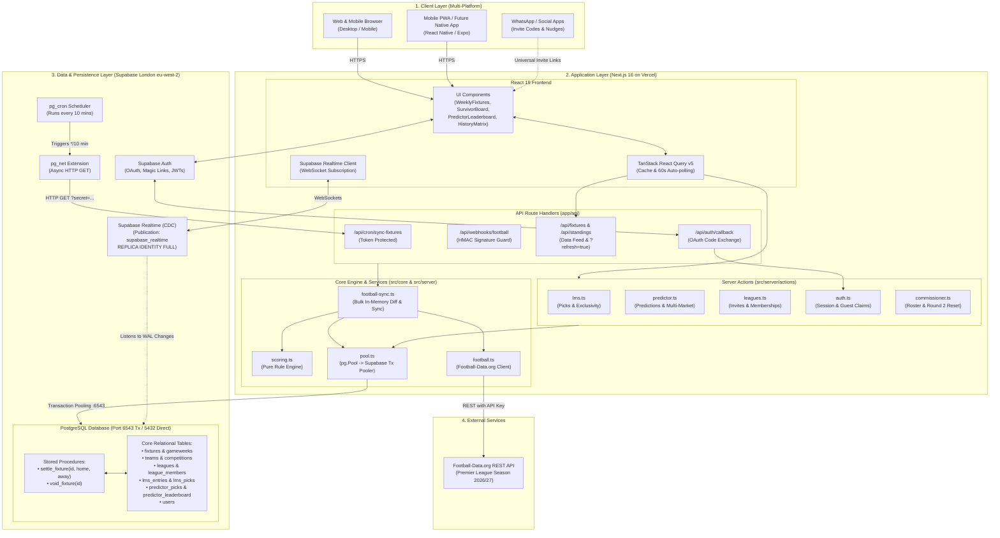
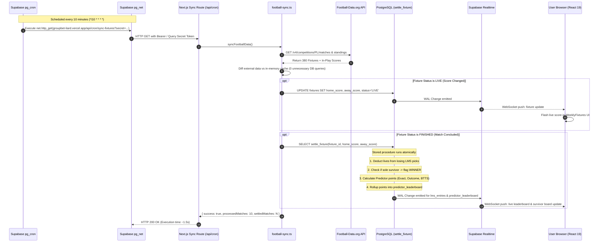

# GroupBet — High-Level System Architecture

This document provides a comprehensive architectural breakdown of the **GroupBet** platform, illustrating component relationships, data flow, background scheduling, and the live matchday synchronization pipeline.

---

## 1. High-Level System Architecture Diagram

---

## 2. Matchday Synchronization & Settlement Sequence

This diagram shows how live scores and automatic game settlements operate every 10 minutes:

---

## 3. Core Architectural Layers Explained

### Layer 1: Client & Presentation
- **Framework**: Next.js 16 App Router using React 19 Client and Server Components.
- **State & Caching**: `@tanstack/react-query` manages client-side data fetching with smart 60-second window polling on live matches.
- **Real-Time Push**: `@supabase/supabase-js` subscribes to database changes on `fixtures`, `lms_entries`, `lms_picks`, and `predictor_leaderboard`. When goals are scored or matches finish, the UI updates instantly without requiring a full page refresh.

### Layer 2: Next.js Server & Application Logic
- **Server Actions**:
  - [`lms.ts`](file:///c:/Dev/groupbet/src/server/actions/lms.ts): Enforces atomic row-level locks (`FOR UPDATE`), kickoff deadline cutoffs, no-repeat team constraints, and exclusivity within leagues.
  - [`predictor.ts`](file:///c:/Dev/groupbet/src/server/actions/predictor.ts): Handles multi-market predictions (Exact Score, Outcome, BTTS, Over/Under) and exclusive match claim locks.
  - [`leagues.ts`](file:///c:/Dev/groupbet/src/server/actions/leagues.ts): Manages collision-free 6-character invite codes (`GB-XXXXX`), duel participation for All-in-One leagues, and anti-cheat pick privacy masking (masking opponents' picks until kickoff).
  - [`auth.ts`](file:///c:/Dev/groupbet/src/server/actions/auth.ts): Handles guest sessions, Supabase OAuth token synchronization, and idempotent guest-to-account claiming.
- **Optimized Football Sync Service ([`football-sync.ts`](file:///c:/Dev/groupbet/src/server/services/football-sync.ts))**:
  - Bulk pre-fetches all 380 fixtures into memory.
  - Computes field diffs; unchanged fixtures trigger **0 database queries**.
  - Executes in under **1.9s** on Vercel Serverless.

### Layer 3: Database & Persistence (Supabase PostgreSQL)
- **Connection Strategy**:
  - Prioritizes Supabase **Transaction Pooler (Port 6543)** with `max: 5` and `idleTimeoutMillis: 1000` to prevent connection exhaustion (`EMAXCONNSESSION`).
  - Fallback to Direct URL (Port 5432) for schema migrations.
- **PostgreSQL Stored Procedures**:
  - `settle_fixture(fixture_id, home_score, away_score)`: Atomic transaction that settles both LMS survival/elimination logic and Predictor multi-market scoring, rolling up leaderboard points instantly.
  - `void_fixture(fixture_id)`: Safely voids matches postponed due to weather or cup fixtures without penalizing players.
- **In-Database Cron (`pg_cron` + `pg_net`)**:
  - Eliminates Vercel Hobby tier limitations by scheduling the recurring 10-minute HTTP ping directly from inside PostgreSQL.

### Layer 4: External Integrations
- **Football-Data.org**: Official live Premier League data feed (20 clubs, 380 fixtures, live standings).
- **Social Sharing**: Encoded WhatsApp and native clipboard deep-linking generators ([`sharing.ts`](file:///c:/Dev/groupbet/src/lib/sharing.ts)).
